# Gateway API Benchmarks - Part 3

This part re-runs the [Part 2](./README-v2.md) test suite against the newest releases of every implementation, on a single-node OpenShift Local (CRC) cluster, with the harness reworked so that every scenario measures **one gateway at a time**.

- [Setup](#setup)
- [Changes to the methodology](#changes-to-the-methodology)
- [Results](#results)
  - [Attached routes](#attached-routes)
  - [Route propagation](#route-propagation)
  - [Route changes](#route-changes)
  - [Backend failover](#backend-failover)
  - [Route scale](#route-scale)
  - [ListenerSet scale](#listenerset-scale)
  - [Traffic performance](#traffic-performance)
- [Summary of findings](#summary-of-findings)
- [Reproducing](#reproducing)

## Setup

Run of 2026-09-17 (`results/versions-20260917-part3.csv`):

| Implementation | Version | Chart |
|---|---|---|
| Agentgateway | v1.5.0 | `cr.agentgateway.dev/charts/agentgateway` v1.5.0 |
| Envoy Gateway | v1.9.1 | `docker.io/envoyproxy/gateway-helm` v1.9.1 |
| Istio | 1.31.0 | `ghcr.io/istio/release/charts/istiod` 1.31.0 |
| Nginx Gateway Fabric | 2.7.2 | `ghcr.io/nginx/charts/nginx-gateway-fabric` 2.7.2 |
| HAProxy Unified Gateway | 1.0.7 | `haproxytech/haproxy-unified-gateway` 1.2.0 |
| Gateway API CRDs | v1.6.2 | experimental channel |

Cluster: OpenShift Local 4.22 (Kubernetes 1.35), one node with 24 vCPU and 24 GB RAM. Load generators, probes and gateways all share that node, so absolute numbers are not comparable with the cloud clusters used in Parts 1 and 2; relative comparisons between implementations are the point.

Upgrade notes (all encoded in `install/basic.sh`):

- Istio 1.31 charts are only published as OCI artifacts on `ghcr.io/istio/release/charts`; the old GCS Helm repository does not carry 1.31.
- The Envoy Gateway CRD chart no longer fits in a Helm release Secret (>1 MiB), so its CRDs are rendered with `helm template` and applied with `kubectl apply --server-side`.
- Nginx Gateway Fabric 2.7 requires its CRDs to be applied out of band before `helm upgrade`. Upgrading from 2.6 hits a transient "`worker_processes` directive is duplicate" error while the old data-plane pod is still connected ([nginx/nginx-gateway-fabric#5883](https://github.com/nginx/nginx-gateway-fabric/issues/5883)); the Gateway stayed `Programmed=False` until the control plane was restarted.
- OpenShift's cluster-version operator recreates the Gateway API CRD admission binding within seconds, so installing the CRDs needs a delete-and-apply retry loop.

## Changes to the methodology

Going over the scenarios before running them turned up several things that would have made the results incoherent:

1. **ListenerSets were silently rejected.** The Gateways did not set `spec.allowedListeners`, and the default is to allow none, so every ListenerSet in the ListenerSet scale test was `Accepted=False (NotAllowed)`. The test was measuring the cost of rejecting resources. All Gateways now allow ListenerSets from all namespaces. With that fixed, Agentgateway, Envoy Gateway, Istio **and Nginx** accept ListenerSets; HAProxy leaves them `Pending`, so it is excluded from that test.
2. **Tests shared a backend.** The route-propagation, route-change and backend-failover tests all created a Service named `backend` selecting `app=backend` in the `default` namespace. The failover test's Service therefore also selected the probe test's leftover pod, and the route-change test ran against a Deployment that was still rolling out because the previous test had applied a different spec. The route-change run measured 37% "errors" on Agentgateway that were in fact requests to a terminating pod on the alternate port. Each test now owns a distinctly named backend, waits until no old pod is terminating, and deletes its backend when done.
3. **Failover cleanup leaked routes.** The failover test renders 16 HTTPRoutes but deleted only the first one, leaving 15 routes (pointing at every gateway) behind for later tests. All documents are deleted now.
4. **Failover policies lived outside the repo.** A DestinationRule and a BackendTrafficPolicy (with *active* health checks) were applied by hand and never removed, so Istio and Envoy Gateway had been measured with different, undocumented policies. The baseline now runs with no implementation-specific policy; the "outlier" variant (`FAILOVER_POLICIES=outlier`) applies the same passive outlier-detection settings to Istio and Envoy Gateway, and the "active" variant is kept for reference. The manifests are in `tests/backendfailover/policies/`.
5. **Retries cannot be disabled any more.** Part 2 set `retry.attempts: 0` on the failover routes. Gateway API v1.6 requires `attempts >= 1`, so the baseline now reflects each implementation's default retry policy. Istio (2 retries by default), HAProxy and Nginx retry failed requests; Agentgateway and Envoy Gateway do not.
6. **Scale tests run per gateway.** Route scale and ListenerSet scale previously attached every route to all gateways at once, so five control planes competed for the same CPUs while being measured. Each gateway now gets its own run; the resource snapshot still covers all implementations, which makes the cost of processing routes aimed at *another* gateway visible ("bystander" cost). `COMBINED=1` restores the old behaviour.
7. **The ListenerSet TLS secret was `Opaque`.** pilot-load's builtin `tls-secret` template renders an `Opaque` Secret. Nginx rejects it (`InvalidCertificateRef`) and Envoy Gateway marks the ListenerSet accepted but never programs the listener, so their data planes sat idle during the first ListenerSet run. The test now generates proper `kubernetes.io/tls` Secrets (still rotated during the run).
8. **Attached-routes now records controller CPU.** Route creation is rate-limited by the generator, so all implementations report the last route attached after ~40 s; the interesting number is how much work each controller does to get there.

Every scenario, including the traffic test, runs one gateway at a time.

## Results

The full tables are in `results/summary-20260917-part3.md`; the graphs below are generated by `scripts/plot_results.py` from the raw CSVs in `results/`.

### Attached routes

100 HTTPRoutes are created (then deleted) against one gateway at a time, and the `attachedRoutes` count in the Gateway status is watched.

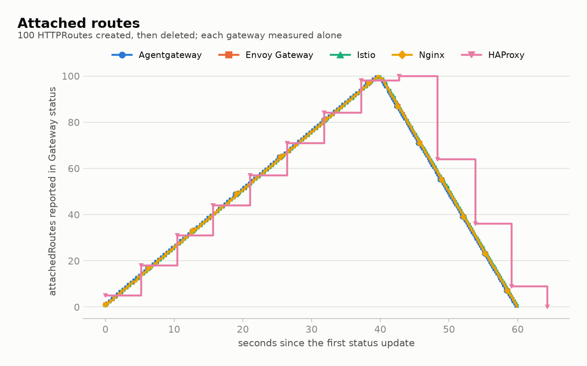

Route creation is rate limited by the generator, so every implementation reports all 100 routes attached after ~39 s and back to 0 about 20 s after deletion starts. The one visible difference is *how* the status is written: four implementations update the status on every route (200 writes), HAProxy batches its status writes every ~5 s (13 writes).

What differs is the CPU each controller spends to get there:

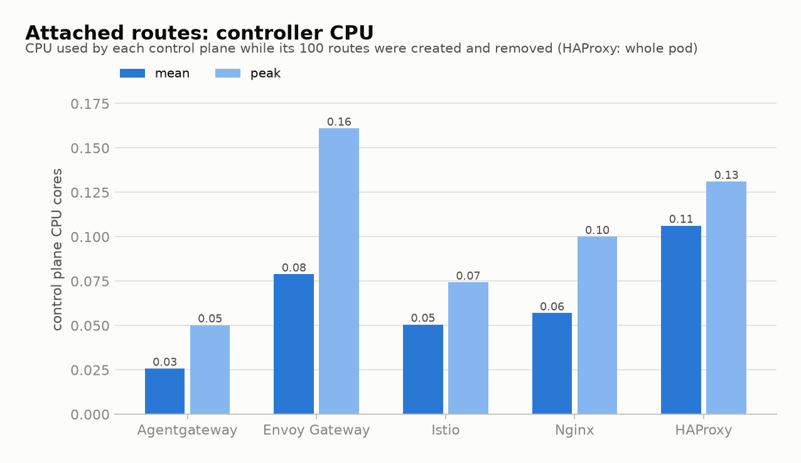

| | Agentgateway | Envoy Gateway | Istio | Nginx | HAProxy |
|---|---:|---:|---:|---:|---:|
| Mean control-plane CPU (cores) | 0.03 | 0.08 | 0.05 | 0.06 | 0.11 (whole pod) |

Envoy Gateway still uses ~3x the CPU of Agentgateway for the same status work, but the 10x gap of Part 2 has narrowed. The Nginx **data plane** also reloads for every route change and used ~0.8 cores while its routes were being created, which is invisible in the control-plane numbers.

### Route propagation

Each new HTTPRoute is probed until the gateway serves it; the delay between creation and the first 200 is recorded (100 routes, one gateway at a time).

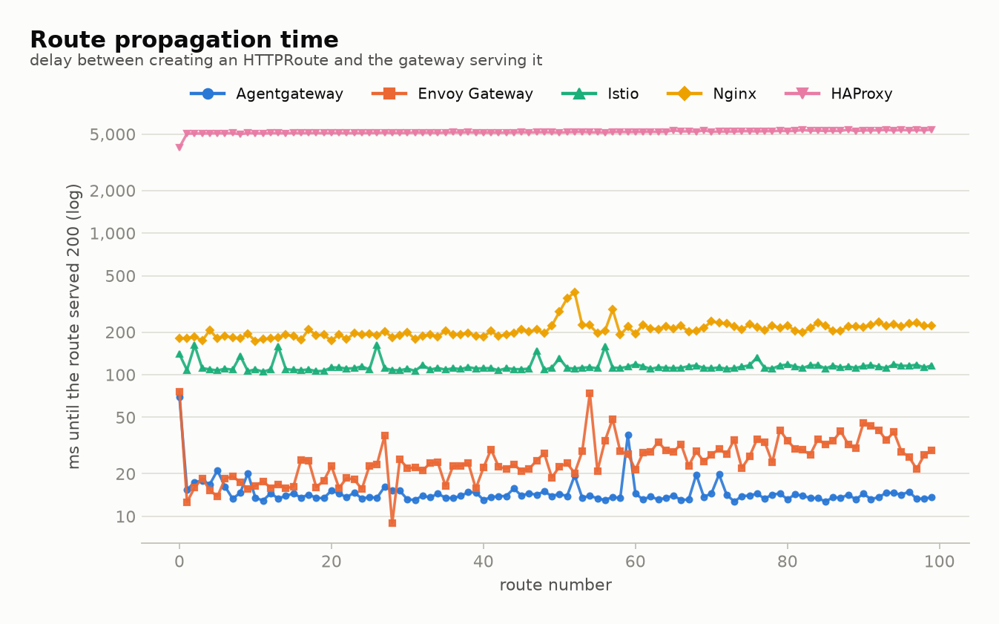

| | Agentgateway | Envoy Gateway | Istio | Nginx | HAProxy |
|---|---:|---:|---:|---:|---:|
| Median (ms) | 14 | 24 | 112 | 204 | 5,153 |
| p99 (ms) | 38 | 74 | 161 | 345 | 5,371 |
| Error responses while waiting | 0 | **33** | 0 | 0 | 0 |

- Agentgateway remains the fastest (14 ms median), followed by Envoy Gateway, Istio and Nginx, in the same order and roughly the same ratios as Part 2.
- ❌ Envoy Gateway again answers **503** on a third of the new routes before it serves them: the route is accepted into the listener before its cluster is ready. Every other implementation returns 404 until the route is live.
- HAProxy applies configuration on a ~5 s timer, so every route takes 5.1–5.4 s to become reachable.

### Route changes

One HTTPRoute is modified 10 times (200 ms apart) while it is probed continuously (one gateway at a time).

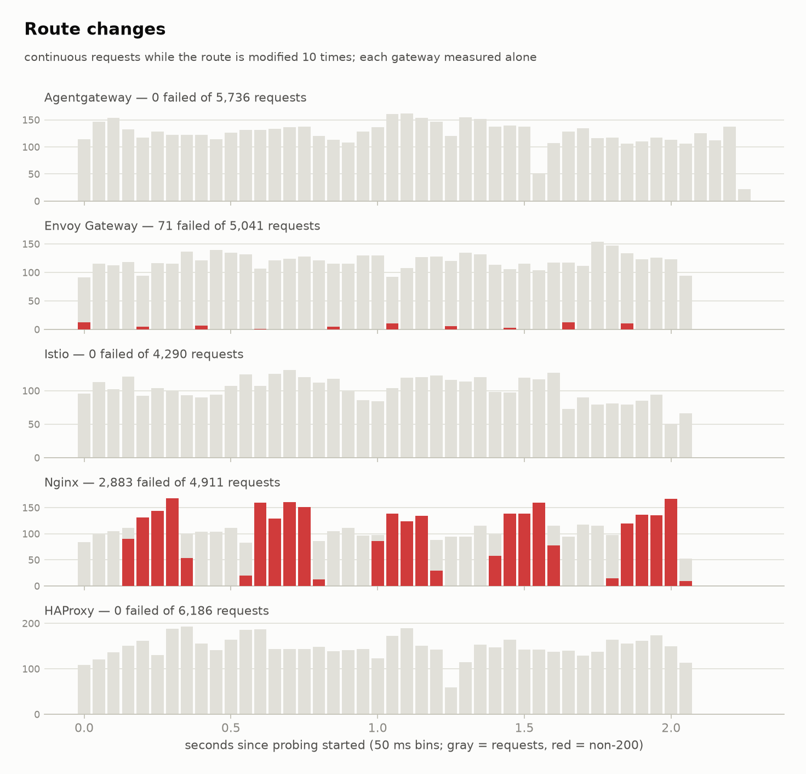

| | Agentgateway | Envoy Gateway | Istio | Nginx | HAProxy |
|---|---:|---:|---:|---:|---:|
| Requests | 5,736 | 5,041 | 4,290 | 4,911 | 6,186 |
| Errors | 0 | 71 (1.4%) | 0 | **2,883 (58.7%)** | 0 |
| Codes | | 500, 503 | | 500 | |

Agentgateway, Istio and HAProxy serve every request through the changes. Envoy Gateway drops a burst of 500/503s right after each change, as in Parts 1 and 2. Nginx returns 500 for more than half of the requests during the test: every change triggers a config apply, and requests arriving while the new config is being validated and reloaded fail.

Note: the first attempt at this test reported 37% errors on Agentgateway and 52% on Envoy Gateway. Those were requests routed to a *terminating* pod that no longer listened on the alternate port, because the previous test had left a differently-specified `backend` Deployment behind and the rollout was still draining. It is a useful reminder that "serving but terminating" endpoints are still routed to by some implementations, but it is not what this test measures, so the harness now waits for old pods to disappear (see [Changes to the methodology](#changes-to-the-methodology)).

### Backend failover

A Service with three healthy pods and one pod that is made unreachable (TCP resets via iptables) for 22 s, three times. 16 HTTPRoutes with different paths point at the Service; requests rotate over the paths at ~200/s. What matters is how many requests reach the flapping pod while it is down, and how quickly traffic returns once it is healthy.

**Baseline** – no implementation-specific policy, each implementation's default retry behaviour (retries cannot be disabled through Gateway API v1.6, see above):

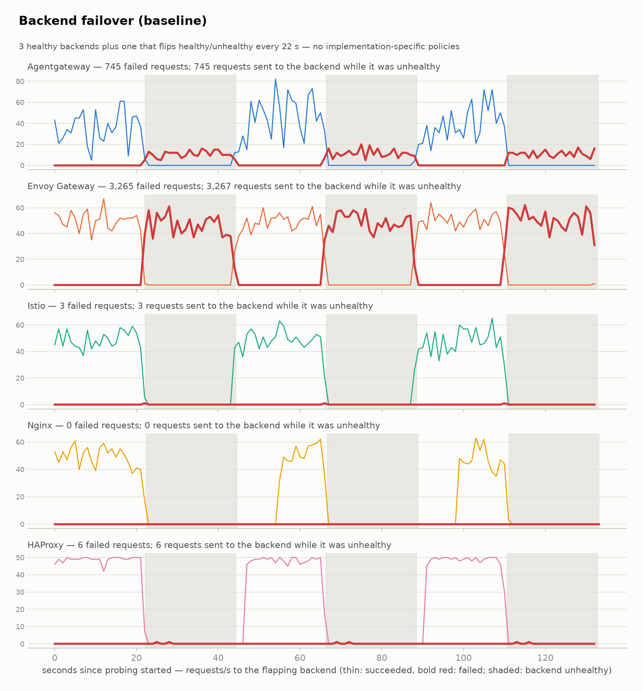

| | Agentgateway | Envoy Gateway | Istio | Nginx | HAProxy |
|---|---:|---:|---:|---:|---:|
| Requests | 25,348 | 25,965 | 22,409 | 26,290 | 22,533 |
| Failed (503) | 745 | **3,265** | 3 | 0 | 6 |
| Sent to the pod while it was down | 745 | 3,267 | 3 | 0 | 6 |

- Envoy Gateway keeps sending a full quarter of the traffic to the dead pod for the whole 22 s, every time. It has no default retry and no passive health tracking.
- Agentgateway also has no default retry, but its load balancer prefers endpoints that are responding, so the dead pod gets ~1/4 of its previous share (745 failures instead of ~3,300).
- Istio, HAProxy and Nginx report (almost) no failures, but for different reasons. Istio's default retry policy (2 attempts on connect failures and 503s) transparently re-sends the request to a healthy pod; HAProxy configures active health checks (`check`) on every server and retries; Nginx evicts a failing endpoint for 10 s and retries. Nginx's recovery is the slowest: traffic only returns to the pod ~10 s after it is healthy again, versus ~2 s for Istio and HAProxy and a gradual ramp for Agentgateway.

**Outlier detection variant** – the same passive outlier-detection policy applied to Istio (DestinationRule) and Envoy Gateway (BackendTrafficPolicy); the others are unchanged:

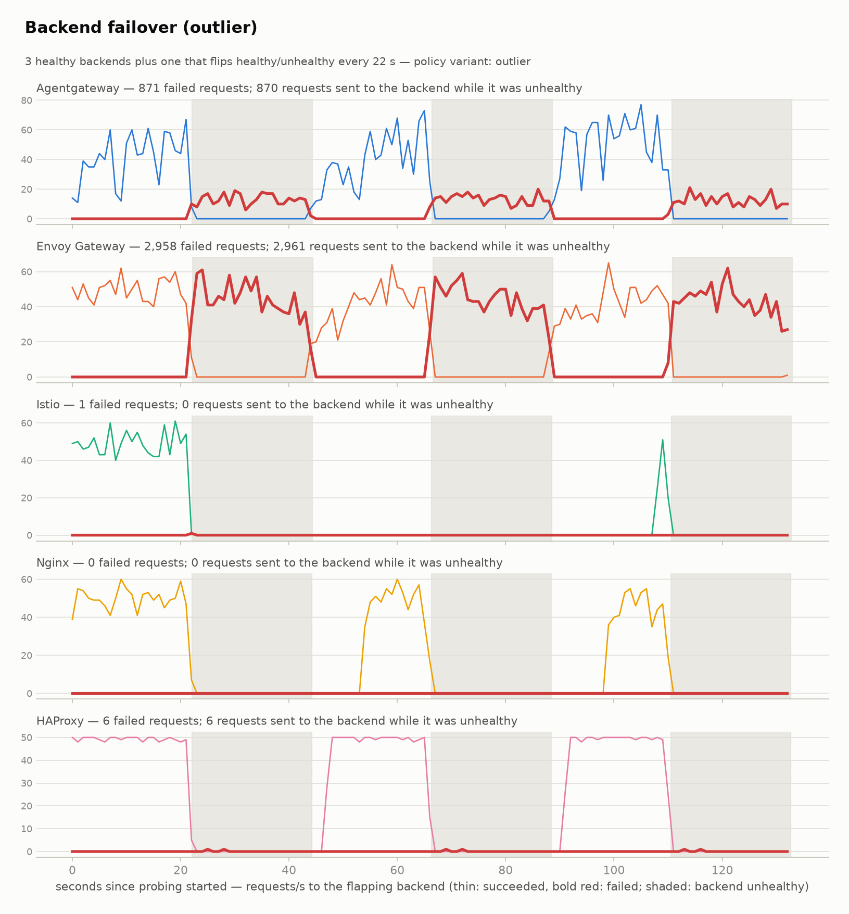

| | Agentgateway | Envoy Gateway | Istio | Nginx | HAProxy |
|---|---:|---:|---:|---:|---:|
| Failed (503) | 871 | **2,958** | 1 | 0 | 6 |
| Sent to the pod while it was down | 870 | 2,961 | 0 | 0 | 6 |

Istio now sends nothing at all to the pod while it is down. Envoy Gateway, configured with the same Envoy outlier-detection settings, still sends ~3,000 requests to it: as explained in Part 2, Envoy Gateway creates one Envoy cluster per HTTPRoute backend, so the 5-consecutive-error threshold has to be reached 16 times over (once per route) before the endpoint is ejected. This has not changed in v1.9.

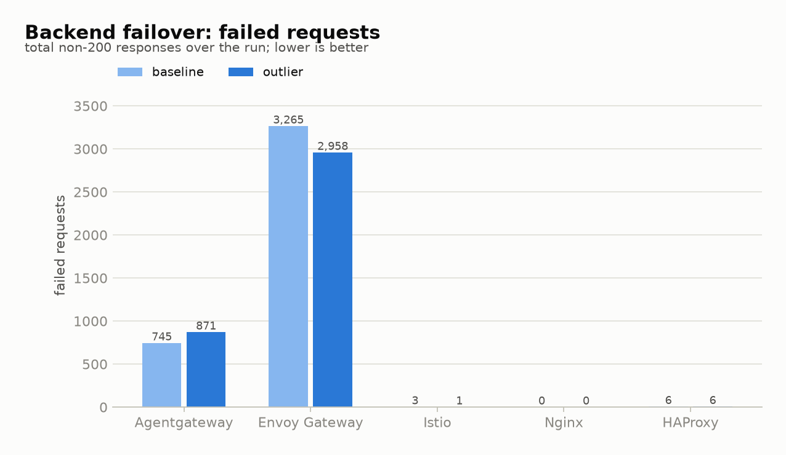

### Route scale

10 namespaces × 100 applications, each with a pod and an HTTPRoute (1,000 routes and 1,000 pods), generated for 5 minutes with continuous churn, one gateway at a time.

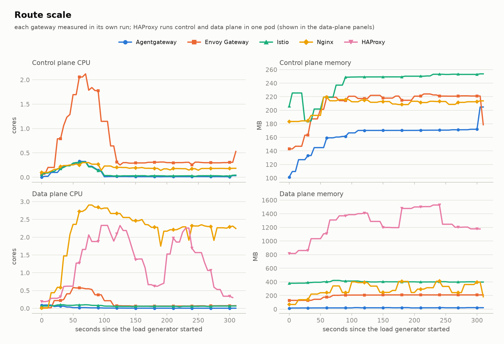

| | Agentgateway | Envoy Gateway | Istio | Nginx | HAProxy |
|---|---:|---:|---:|---:|---:|
| Control plane mean CPU (cores) | 0.07 | **0.62** | 0.08 | 0.20 | – |
| Control plane mean memory (MB) | 162 | 209 | 240 | 208 | – |
| Data plane mean CPU (cores) | 0.02 | 0.16 | 0.07 | **2.15** | 1.27 (whole pod) |
| Data plane mean memory (MB) | 20 | 194 | 400 | 289 | 1,252 (whole pod) |

- Agentgateway again uses the least of everything: 20 MB of data-plane memory against 194–400 MB for the Envoy-based data planes.
- Envoy Gateway's control plane peaks at 2.1 cores while the routes are created, ~9x Agentgateway's.
- ❌ The Nginx data plane burns **2+ cores for the whole run**: NGINX OSS has no dynamic endpoint updates, so every pod change is a full config reload.
- ❌ HAProxy grows to **1.5 GB** during the test and never gives the memory back: its pod was at 0.9 GB an hour after all routes were deleted. HAProxy also uses the most CPU of any bystander (0.19 cores) while other gateways' routes are being generated.

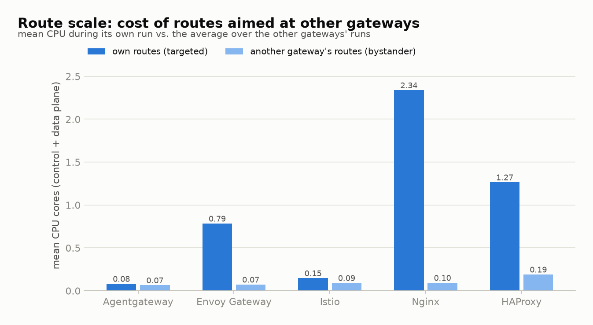

Normalized with the Part 2 formula (80% data plane, 20% control plane, each metric relative to the best implementation; HAProxy cannot be scored because its planes are not separable):

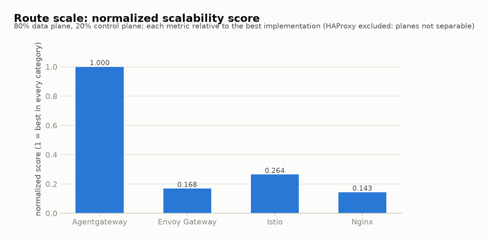

| Agentgateway | Envoy Gateway | Istio | Nginx |
|---:|---:|---:|---:|
| 1.000 | 0.168 | 0.264 | 0.143 |

### ListenerSet scale

10 namespaces × 10 applications, each with a ListenerSet (an HTTPS listener with its own certificate, rotated periodically) and 16 HTTPRoutes attached to it: 100 ListenerSets and 1,600 routes, generated for 5 minutes with churn, one gateway at a time. HAProxy does not act on ListenerSets (they stay `Pending`) and is excluded.

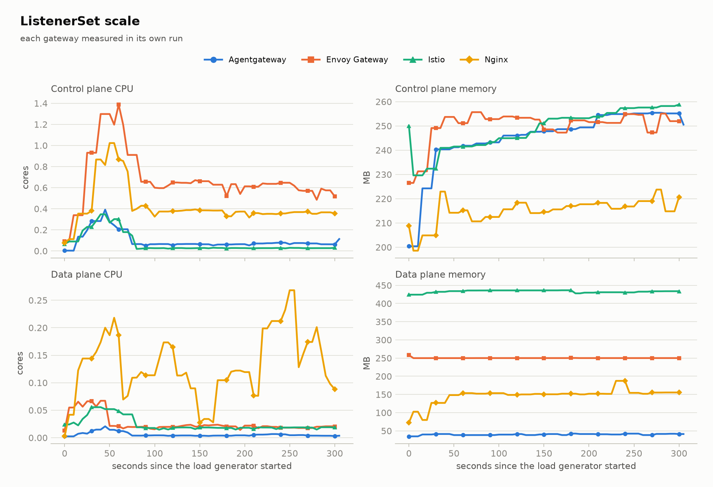

| | Agentgateway | Envoy Gateway | Istio | Nginx |
|---|---:|---:|---:|---:|
| Control plane mean CPU (cores) | 0.10 | **0.68** | 0.07 | 0.42 |
| Control plane mean memory (MB) | 245 | 250 | 249 | 215 |
| Data plane mean CPU (cores) | 0.006 | 0.026 | 0.024 | **0.13** |
| Data plane mean memory (MB) | 40 | 250 | 433 | 147 |

- With ListenerSets now accepted everywhere, Nginx joins the test and does reasonably: its control plane is the second most expensive (0.42 cores) and its data plane the busiest, again because every change is a full reload, but it is far from the 2 cores of the route-scale test (100 pods here vs 1,000).
- Envoy Gateway's control plane again dominates CPU (0.68 cores on average, 6–9x Agentgateway/Istio) and stays at 0.6 cores in steady state, where the others drop to well under 0.1.
- Agentgateway's data plane holds 100 TLS listeners and 1,600 routes in 40 MB; the Envoy-based data planes use 250 MB (Envoy Gateway) and 433 MB (Istio).
- ⚠️ Nginx is the only implementation that **replaces its data-plane pod** when a ListenerSet adds or removes a port: adding port 443 to the Gateway's Service triggers a Deployment rollout. The other three add the port to the existing Service without restarting anything.

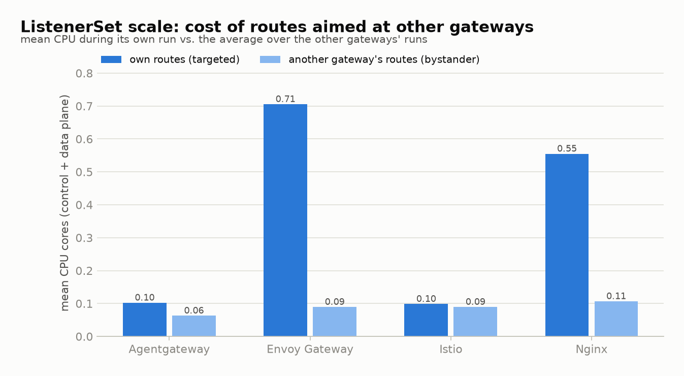

Two harness bugs made the earlier version of this test meaningless, and both are invisible from a green `Programmed=True` on the Gateway: Gateways without `allowedListeners` reject every ListenerSet, and an `Opaque` TLS secret is rejected or silently ignored by two of the four implementations. Both are fixed in the harness (see [Changes to the methodology](#changes-to-the-methodology)).

### Traffic performance

fortio with uncapped QPS for 30 s per point and a 100-byte payload against a single backend pod, one gateway at a time. As in Parts 1 and 2 this only looks for large outliers: the load generator, the gateway and the backend all share the same 24 cores.

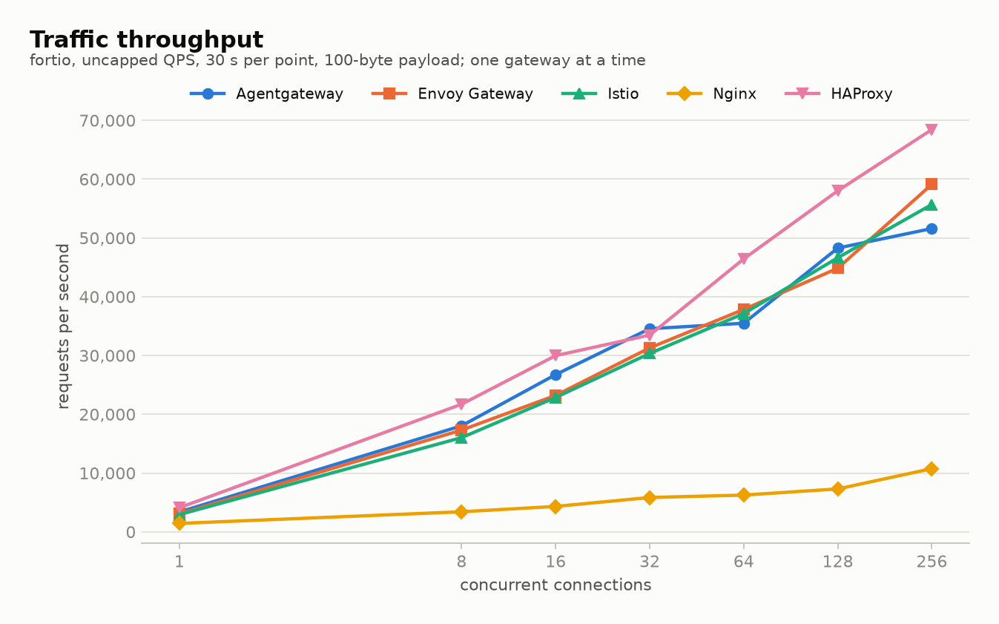

| Connections | Agentgateway | Envoy Gateway | Istio | Nginx | HAProxy |
|---:|---:|---:|---:|---:|---:|
| 1 | 3,379 | 3,062 | 2,932 | **1,426** | 4,108 |
| 8 | 18,034 | 17,305 | 16,025 | **3,407** | 21,707 |
| 32 | 34,554 | 31,294 | 30,344 | **5,837** | 33,472 |
| 128 | 48,277 | 44,846 | 46,626 | **7,296** | 58,022 |
| 256 | 51,596 | 59,119 | 55,693 | **10,746** | 68,445 |

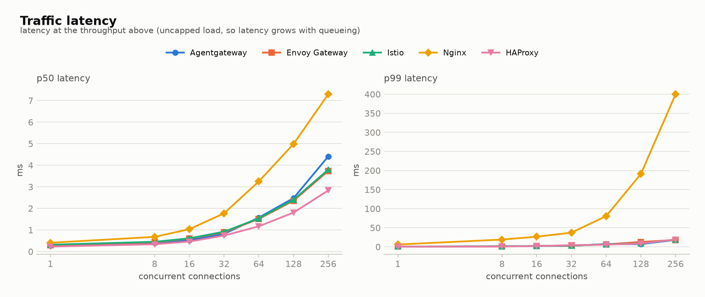

- HAProxy is the fastest data plane here at every connection count, 10–30% ahead of the Envoy-based implementations and Agentgateway, which are within ~10% of each other up to 128 connections. At 256 connections Agentgateway flattens out first.
- ❌ Nginx serves 5–8x fewer requests per second than the others and its p99 explodes (6 ms at 1 connection, 400 ms at 256). Nginx Gateway Fabric does not pool upstream connections unless an `UpstreamSettingsPolicy` asks for it, so every request opens a new TCP connection to the backend. The node's conntrack table, SYN retransmit counters and the nginx error log were checked and are clean, so this is the proxy's default behaviour, not the environment. The connection churn was also enough to make the (single) backend process exit and restart during Nginx's 256-connection run, twice out of two attempts; no other gateway ever triggered that.

## Summary of findings

| | Agentgateway | Envoy Gateway | Istio | Nginx | HAProxy |
|---|---|---|---|---|---|
| Attached routes | ✅ lowest CPU | ⚠️ 3x CPU | ✅ | ⚠️ data plane reloads | ⚠️ batched status |
| Route propagation | ✅ 14 ms | ❌ 503s on new routes | ✅ 112 ms | ✅ 204 ms | ❌ 5 s |
| Route changes | ✅ | ❌ 500/503 bursts | ✅ | ❌ 59% errors | ✅ |
| Backend failover (defaults) | ⚠️ no retry, favours healthy pods | ❌ no mitigation | ✅ retries | ✅ evicts + retries, slow recovery | ✅ health checks + retries |
| Backend failover (outlier detection) | – | ❌ ineffective (per-route clusters) | ✅ | – | – |
| Route scale | ✅ | ❌ control plane CPU | ✅ | ❌ 2+ cores data plane | ❌ 1.5 GB, never released |
| ListenerSet scale | ✅ | ❌ control plane CPU | ✅ | ⚠️ data-plane pod rollouts | ❌ unsupported |
| Traffic | ✅ | ✅ | ✅ | ❌ 5–8x slower | ✅ fastest |

Compared with Part 2, the picture is stable: Agentgateway and Istio behave well throughout, Envoy Gateway keeps its propagation/route-change errors and control-plane cost, Nginx keeps its reload-driven data-plane cost and lack of connection pooling, and HAProxy (now v1.0.7) is a very fast proxy attached to a control plane that batches on a 5 s timer, does not support ListenerSets, and holds on to memory.

## Reproducing

```sh
./install/basic.sh             # installs/upgrades every implementation (OpenShift Local specifics included)
./tests/run-all.sh             # every scenario, one gateway at a time; results/ + results/summary-<run>.md
python3 -m venv .venv && .venv/bin/pip install -r requirements.txt
.venv/bin/python scripts/plot_results.py results   # graphs in results/graphs/
```

`RUN_STEPS` selects a subset of steps (for example `RUN_STEPS=traffic`), `RUN_ID` resumes an existing run, `GATEWAYS` restricts the implementations, `FAILOVER_VARIANTS` selects failover policy variants, and `COMBINED=1` restores the "all gateways at once" mode of the scale tests.
